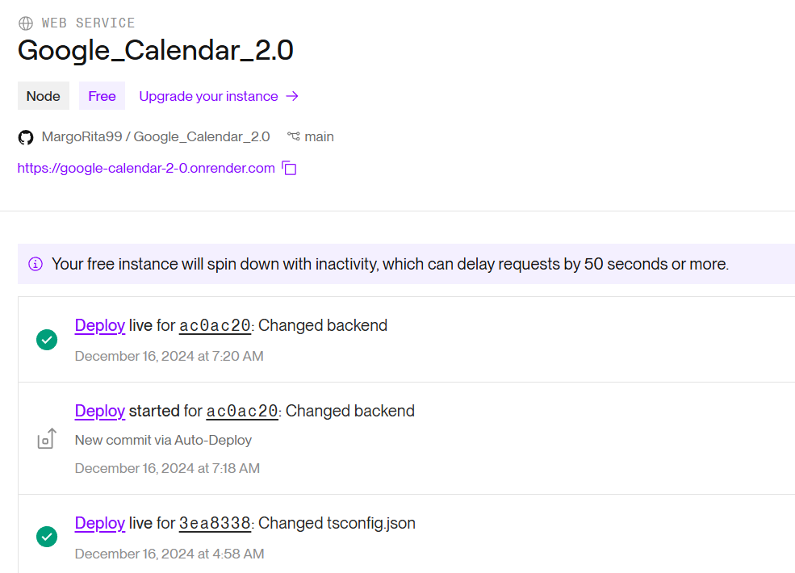

# Google_Calendar_2.0
## Описание проекта
Веб-приложение "Календарь" представляет собой систему для управления событиями, которая интегрируется с Google Календарем. Основной функционал приложения:

Регистрация и авторизация пользователей.
Интеграция с Google Календарем.
Отображение событий из Google Календаря в личном кабинете пользователя.
Возможность редактировать события в личном кабинете, без обратной синхронизации с Google Календарем.
Синхронизация с Google Календарем каждую минуту.
Поддержка повторяющихся событий, с возможностью редактировать каждое событие независимо от других повторов.
## Структура веб-приложения
1. Регистрация
Поля:
email
пароль
повторите пароль
2. Авторизация
Поля:
email
пароль
3. Интеграция с Google Календарем
Кнопка "Подключиться" для интеграции с Google Календарем.
После успешной интеграции появляется блок с настройками, где пользователь может выбрать календари для синхронизации.
4. Календарь событий
Отображение календаря с событиями, синхронизированными с Google Календарем.
Возможность редактирования событий в личном кабинете.
5. Редактирование событий
Возможность редактировать события, синхронизированные с Google Календарем.
Изменения, сделанные в личном кабинете, не синхронизируются обратно в Google Календарь, однако если событие было изменено в Google, оно будет обновлено в приложении.
## Логика взаимодействия
1. Регистрация и Авторизация
Пользователь на стартовой странице может зарегистрироваться, если нет текущего аккаунта или авторизоваться, если он есть.
Зарегистрироваться можно, используя:
- Email и password (стандартная регистрация)
- Google-аккаунт (OAuth2)

2. Интеграция с Google Календарем
После успешной авторизации пользователю предоставляется возможность выбрать календари для синхронизации с приложением.
Для интеграции с Google Календарем используется OAuth2 аутентификация через API Google.
Приложение сохраняет access token и refresh token, чтобы периодически обновлять данные о событиях из выбранных календарей.
3. Синхронизация событий
Приложение синхронизирует события с Google Календарем каждую минуту.
Время синхронизации и обновления событий задается на backend, где происходит регулярное получение данных из Google Календаря и их обновление в базе данных приложения.
4. Редактирование событий
События из Google Календаря отображаются в личном кабинете пользователя.
Пользователь может редактировать события в личном кабинете, но изменения не синхронизируются обратно с Google.
Если пользователь изменяет событие в Google Календаре, оно будет автоматически обновлено в нашем приложении.
## Пояснение функционала приложения
### Регистрация и авторизация
1) Регистрация через стандартный email и пароль
Frontend:
Пользователь вводит email и пароль, а затем отправляет данные на сервер. Для этого используется компонент в папке pages - AuthPage

```typescript
const handleSubmit = async (e) => {
  e.preventDefault();
  if (!isLogin) {
    const res = await axios.post('${process.env.REACT_APP_API_URL}/api/register', { email, password });
    alert('Регистрация успешна, войдите в аккаунт.');
    setIsLogin(true);
  }
};
```
Backend:
Контроллер UserController получает данные и вызывает метод сервиса createUser для сохранения пользователя в базе данных.

```typescript
@Post('register')
async register(@Body('email') email: string, @Body('password') password: string) {
  const user = await this.usersService.createUser(email, password);
  return { message: 'Регистрация успешна', userId: user.id };
}
```
Внутри UserService используется библиотека bcrypt для хэширования пароля перед сохранением:

```typescript
const hashedPassword = await bcrypt.hash(password, 10);
const user = new User();
user.email = email;
user.password = hashedPassword;
return this.userRepository.save(user);
```
2) Авторизация через email и пароль
Frontend:
Пользователь вводит email и пароль, которые отправляются на сервер. Используется метод handleSubmit в компоненте AuthPage:

```typescript
const handleSubmit = async (e) => {
  e.preventDefault();
  if (isLogin) {
    const res = await axios.post('${process.env.REACT_APP_API_URL}/api/login', { email, password });
    localStorage.setItem('token', res.data.accessToken); // Сохраняем токен
  }
};
```
Backend:
Контроллер AuthController вызывает метод validateUser из AuthService, чтобы проверить введенные данные. Сначала мы ищем пользователя по email в БД. Далее хэш его пароля сравнивается с помощью bcrypt.compare. Если пользователь существует и пароль совпадает, генерируется JWT-токен

```typescript
@Post('login')
async login(@Body('email') email: string, @Body('password') password: string): Promise<{ accessToken: string }> {
  const user = await this.authService.validateUser(email, password);
  return this.authService.generateToken(user);
}
```
3) Авторизация через Google
Frontend:
Пользователь нажимает кнопку "Войти через Google". Используется библиотека @react-oauth/google для получения токена от Google.

```typescript
const handleGoogleLogin = async (response) => {
  const { tokenId } = response;
  const res = await axios.post('${process.env.REACT_APP_API_URL}/api/google-login', { tokenId });
  localStorage.setItem('token', res.data.accessToken);
};
```

Backend:
Контроллер AuthController вызывает handleGoogleLogin из AuthService, чтобы обработать токен от Google.
Проверка токена через google-auth-library:

```typescript
const ticket = await this.googleClient.verifyIdToken({
  idToken: tokenId,
  audience: process.env.GOOGLE_CLIENT_ID,
});
```
Если токен валиден, извлекается email из данных Google:
```typescript
const payload = ticket.getPayload();
const email = payload?.email;
```
### Интеграция с Google Календарем
Для интеграции приложения с Google Calendar используется Google Calendar API. Эта интеграция позволяет пользователям получать доступ к своим событиям, синхронизировать их с приложением и управлять ими.

1) Для получения CLIENT_ID и CLIENT_SECRET нужна настройка Google API Console
2) Google OAuth добавляется в backend. Для этого используется OAuth2Client из библиотеки google-auth-library,  которая используется для верификации токенов Google.Также реализуется эндпоинт для обработки токенов, полученных с фронтенда.
Пример с AuthService:
```typescript
import { Injectable, UnauthorizedException } from '@nestjs/common';
import { OAuth2Client } from 'google-auth-library';
import { UserService } from 'src/user/user.service';
import { JwtService } from '@nestjs/jwt';

@Injectable()
export class AuthService {
  private googleClient: OAuth2Client;

  constructor(
    private readonly userService: UserService,
    private readonly jwtService: JwtService,
  ) {
    this.googleClient = new OAuth2Client(process.env.GOOGLE_CLIENT_ID);
  }
}
```
3) Google OAuth добавляется во frontend. Для этого используется GoogleLogin из библиотеки @react-oauth/google
4) Для получения данных событий используется Google Calendar API. Так метод events.list возвращает события для выбранного календаря

```typescript
async getEvents(accessToken: string, calendarId: string): Promise<calendar_v3.Schema$Event[]> {
    const auth = new google.auth.OAuth2();
    auth.setCredentials({ access_token: accessToken });

    const response = await this.calendar.events.list({
      auth,
      calendarId,
      timeMin: new Date().toISOString(), 
      singleEvents: true,
      orderBy: 'startTime',
    });
```
5) Для периодической синхронизации событий каждые 1 минуту можно использовалась CRON задача с использованием библиотеки @nestjs/schedule
Декоратор принимает Cron-выражение, определяющее частоту выполнения задачи. В данном случае используется CronExpression.EVERY_MINUTE. Метод this.userService.getUsersWithGoogleTokens() возвращает всех пользователей, у которых сохранены токены для работы с Google Calendar.
Для каждого пользователя токен передается в метод this.googleService.getEvents(user.tokens), который вызывает API Google Calendar для получения актуального списка событий.
Метод this.syncEvents(user.id, googleEvents) сравнивает события из Google Calendar с локальными событиями в базе данных:
- Новые события добавляются
- Удаленные события помечаются как удаленные
- Измененные события обновляются в локальной базе

```typescript
@Cron(CronExpression.EVERY_MINUTE)
  async syncGoogleCalendars() {
    this.logger.log('Starting calendar synchronization...');

    const users = await this.userService.getUsersWithGoogleTokens();

    for (const user of users) {
      try {
        
        const googleEvents = await this.googleService.getEvents(user.tokens);

        await this.syncEvents(user.id, googleEvents);

        this.logger.log(`Successfully synced events for user ${user.email}`);
      } catch (error) {
        this.logger.error(`Error syncing events for user ${user.email}`, error.stack);
      }
    }
  }
```

## Технологии, использованные в проекте
- Frontend: React.js для пользовательского интерфейса, axios для выполнения HTTP-запросов к backend
- Backend: NestJS для создания RESTful API, TypeORM для работы с базой данных, Google APIs для интеграции с Google Календарем
- База данных: PostgreSQL для хранения данных о пользователях, событиях и календарях

Приложение было реализовано в одном репозитории, но разделено на отдельные папки: frontend и backend. Для хостинга и деплоя серверной и клиентской части веб-приложения использовался Render. Это популярная платформа для автоматического развертывания приложений, которая поддерживает бэкенд на базе Node.js/NestJS и фронтенд на React.


Для настройки проекта использовалась [документация Google Calendar API](https://developers.google.com/calendar)